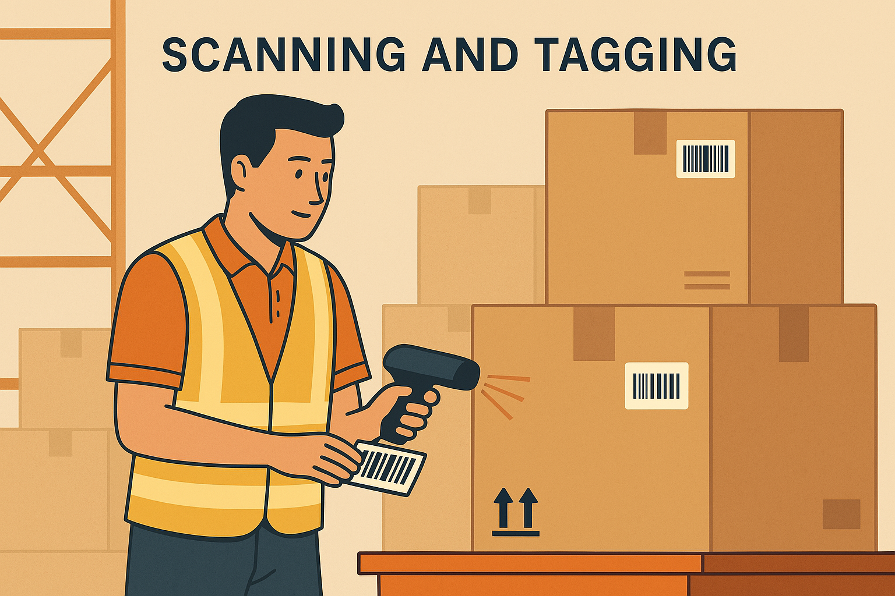
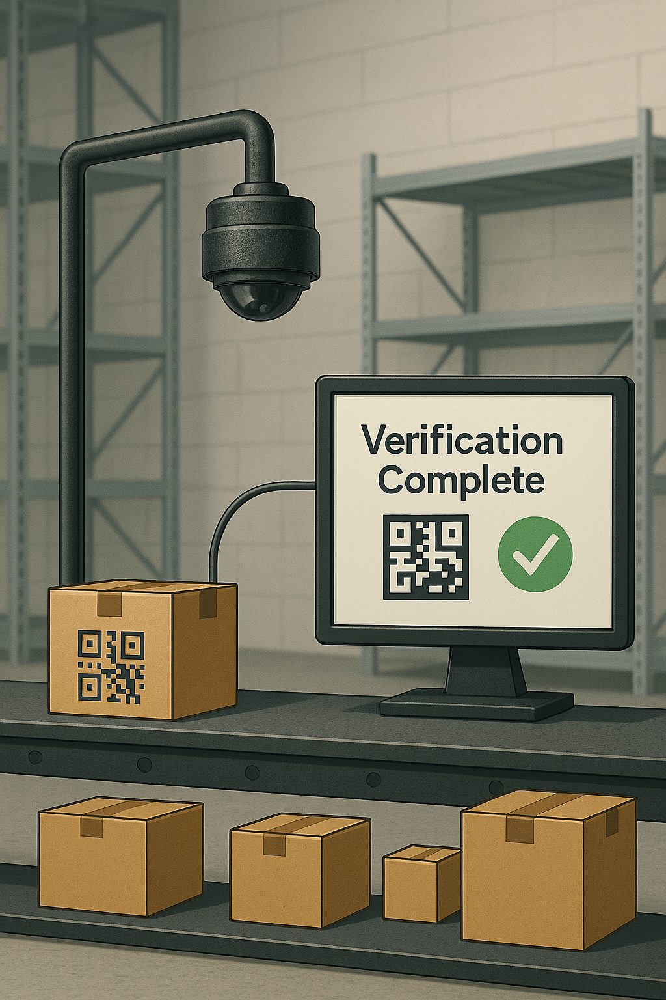

# 📦 QR Detection System

This project is developed to detect QR codes on packages moving along a conveyor belt in the receiving inventory section of a warehouse. 

The QR code includes the **product ID**, which is extracted and stored in a database for further processing within the warehouse workflow.

# Check for the releases
* tag - v1.0 contains the YOLOv11 medium model trained on 2d matrix dataset(High accuracy but slow detections)
* tag - v2.0 contains the YOLOv11 nano model trained on the same dataset(Less accuracy but fast detections) 
---

## 🔁 Basic Workflow

- 🎥 A **camera** is integrated with the system to capture images of QR codes on moving packages.
- 🧠 The computer applies **image processing techniques** to enhance the captured QR code.
- 📇 The QR code is then scanned to extract the **Product ID**.

## ⚠️ Corner Cases & Challenges

- ⏱️ **High-speed belt movement** requires fast and accurate detection.
- 📦 Packages vary in size — large packages are easy to scan, but **small packages pose challenges** due to a fixed camera position.
- 🎯 QR code placement and orientation on each package is **inconsistent**.

## 🛠️ Solutions to Challenges

- 🧪 *If we need accurate predictions with low speed we use medium model whereas if we need faster predictions we use nano model with less accurate predictions. Still there is a lot to improve regarding accuracy. *
- ✨ **Enhancing QR code quality** using image pre-processing for reliable scans.
- 🧍‍♂️ Trained a **YOLO model on 2D matrix patterns** to locate and isolate QR codes efficiently.

## 🧾 Manual Process of Scanning

📸 A human manually positions the camera and scans the QR code.

## 🤖 Automated Process of Scanning

🚀 Camera + YOLO + QR Scanner working together in real-time.

